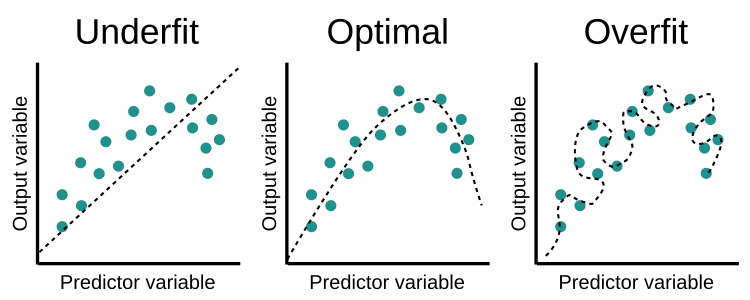
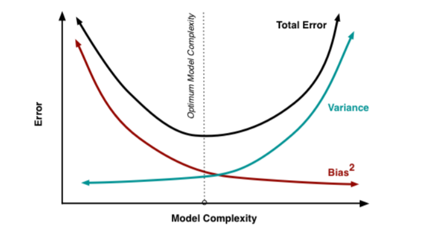

 # Validation and Regularization of Linear Regression
**Major challenges of machine learning:**   
1. **Overfitting**
2. **Underfitting**

## Overfitting:
###### Overfitting refers to a model that models the training data too well by learning the details and noise in the training data.
**It occurs when**
1. Model is too complex
2. Model have more no. of features
**They tend to have more variance in their predictions but less bias towards wrong outcomes**   
**It has more training accuracy and less testing accuracy**

## Underfitting:  
###### Underfitting refers to a model that can neither model the training data nor generalize to new data.** 
**It occurs when**  
1. Model is too simple
2. Model have too few features
**They tend to have less variance in their predictions but more bias towards wrong outcomes**  
**It has less training accuracy and less testing accuracy**  

## Plot of overfitting, optimal fitting and underfitting

## Plot of complexity vs accuracy
 

## Overcoming overfitting and underfitting

### Underfitting:

1. **Increase the size or no. of parameters in the model** 
2. **Increase the complexity or type of the moedel**
3. **Increase the training time until cost function is minimised**

### Overfitting:

1. **Validation** 
2. **Regularization**

### Validation:

**Validation is a process of evvaluating ML model by training several ML models on subsets of the available data and evaluating them on the complementary subset of the data.**

### Regularization:

**Regulariztion tunes the hypothesis by adding an additional penalty term that controls the hypothesis such that the coefficients don't take the extreme values in the cost function. It keeps all features but reduces the magnitude of parameters** 

1. **Lasso Regularization**
2. **Ridge Regularization**

### Lasso Regularization:
#### Adds absolute of coeffiecient values as penalty term.
****

### Ridge Regularization:
#### Adds square of coeffiecient values as penalty term.
****
